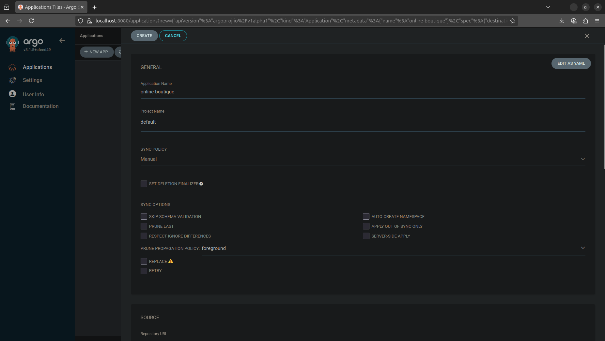
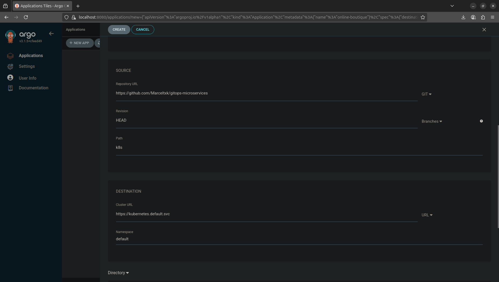
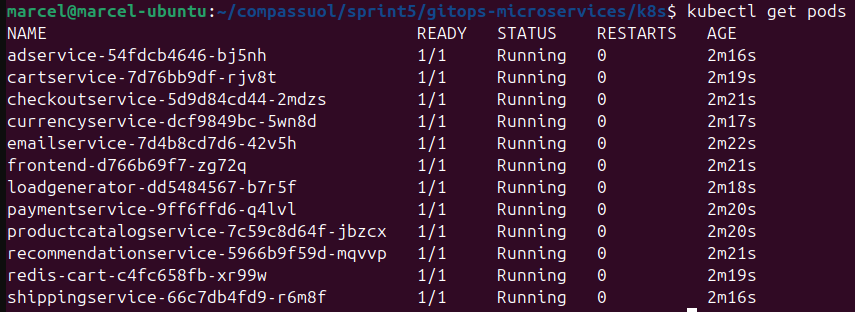
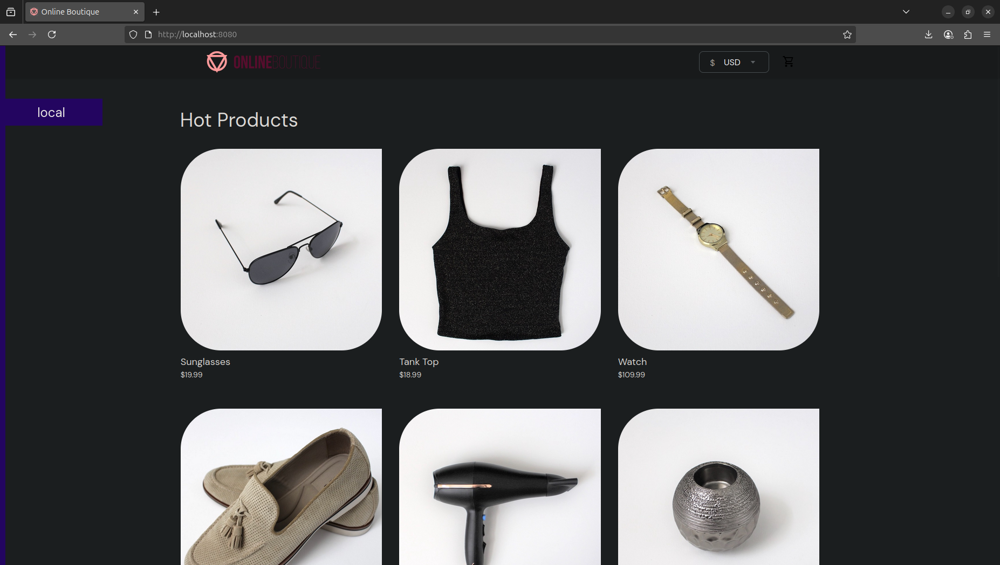

# GitOps na Prática - Kubernetes com ArgoCD

## Visão Geral

Este projeto demonstra a implementação prática de GitOps usando Kubernetes e ArgoCD para automatizar o deploy de uma aplicação de microserviços. Utilizaremos o exemplo **Online Boutique** do Google Cloud Platform para simular um ambiente de produção cloud-native.

### Objetivo

Executar um conjunto de microserviços (Online Boutique) em Kubernetes local usando Rancher Desktop, controlado por GitOps com ArgoCD, a partir de um repositório público no GitHub.


## Arquitetura

O projeto implementa uma arquitetura GitOps onde:
- **Git** é a fonte única da verdade para infraestrutura e aplicações
- **ArgoCD** monitora o repositório e aplica automaticamente as mudanças
- **Kubernetes** orquestra os microserviços da aplicação
- **Rancher Desktop** fornece o ambiente Kubernetes local

## 🔧 Pré-requisitos

Antes de começar, certifique-se de ter os seguintes componentes instalados:

- [ ] **Rancher Desktop** (com Kubernetes habilitado)
- [ ] **kubectl** configurado (`kubectl get nodes` funcionando)
- [ ] **Git** instalado
- [ ] **Docker** funcionando localmente
- [ ] **Conta no GitHub** com permissões para criar repositórios públicos

### Verificando os Pré-requisitos

```bash
# Verificar Kubernetes
kubectl get nodes

# Verificar Docker
docker --version

# Verificar Git
git --version
```

## Guia de Implementação

### Etapa 1: Fork e Configuração do Repositório GitHub

1. **Fazer fork do repositório oficial:**
   ```bash
   # Acesse e faça fork de:
   # https://github.com/GoogleCloudPlatform/microservices-demo
   ```

2. **Criar novo repositório com a estrutura recomendada:**
   ```
   gitops-microservices/
   └── k8s/
       └── online-boutique.yaml
   ```

3. **Copiar o arquivo de manifests:**
   - Baixe o arquivo `release/kubernetes-manifests.yaml` do repositório original
   - Renomeie para `online-boutique.yaml`
   - Coloque na estrutura acima

### Etapa 2: Instalação do ArgoCD

```bash
# Criar namespace para ArgoCD
kubectl create namespace argocd

# Instalar ArgoCD
kubectl apply -n argocd -f https://raw.githubusercontent.com/argoproj/argo-cd/stable/manifests/install.yaml

# Aguardar pods estarem prontos
kubectl wait --for=condition=available --timeout=600s deployment/argocd-server -n argocd
```

### Etapa 3: Acesso ao ArgoCD

1. **Configurar port-forward:**
   ```bash
   kubectl port-forward svc/argocd-server -n argocd 8080:443
   ```

2. **Obter senha inicial:**
   ```bash
   kubectl -n argocd get secret argocd-initial-admin-secret -o jsonpath="{.data.password}" | base64 -d
   ```

3. **Acessar interface web:**
   - URL: https://localhost:8080
   - Usuário: `admin`
   - Senha: (obtida no comando anterior)

### Etapa 4: Configuração da Aplicação no ArgoCD

#### Via Interface Web:

1. **Criar Nova Aplicação:**
   - Clique em "+ NEW APP"
   - Preencha os dados:
     - **Application Name**: `online-boutique`
     - **Project**: `default`
     - **Sync Policy**: `Manual`

2. **Configurar Repositório:**
   - **Repository URL**: `https://github.com/SEU-USUARIO/gitops-microservices`
   - **Revision**: `HEAD`
   - **Path**: `k8s`

3. **Configurar Destino:**
   - **Cluster URL**: `https://kubernetes.default.svc`
   - **Namespace**: `default`




#### Via CLI (Alternativa):

```bash
# Login no ArgoCD CLI
argocd login localhost:8080

# Criar aplicação
argocd app create online-boutique \
  --repo https://github.com/SEU-USUARIO/gitops-microservices \
  --path k8s \
  --dest-server https://kubernetes.default.svc \
  --dest-namespace default
```

### Etapa 5: Deploy e Sincronização

1. **Sincronizar aplicação:**
   ```bash
   # Via CLI
   argocd app sync online-boutique
   
   # Ou via interface web: clicar em "SYNC"
   ```

2. **Verificar pods em execução:**
   ```bash
   kubectl get pods
   kubectl get services
   ```




### Etapa 6: Acesso ao Frontend

```bash
# Port-forward para o frontend
kubectl port-forward service/frontend-external 8081:80

# Acessar aplicação
open http://localhost:8081
```



##  Verificação e Monitoramento

### Comandos Úteis

```bash
# Status da aplicação no ArgoCD
kubectl get applications -n argocd

# Logs dos pods
kubectl logs -l app=frontend

# Status dos serviços
kubectl get svc

# Detalhes dos deployments
kubectl get deployments
```

### Troubleshooting

```bash
# Verificar eventos do cluster
kubectl get events --sort-by='.lastTimestamp'

# Descrever pod com problema
kubectl describe pod <POD_NAME>

# Restart do ArgoCD (se necessário)
kubectl rollout restart deployment/argocd-server -n argocd
```

##  Customizações Opcionais

### Alterando Número de Réplicas

1. **Editar o arquivo `k8s/online-boutique.yaml`:**
   ```yaml
   apiVersion: apps/v1
   kind: Deployment
   metadata:
     name: frontend
   spec:
     replicas: 3  # Alterar conforme necessário
   ```

2. **Fazer commit e push:**
   ```bash
   git add .
   git commit -m "Increase frontend replicas to 3"
   git push origin main
   ```

3. **Sincronizar no ArgoCD:**
   - A sincronização pode ser automática (se configurada) ou manual

##  Recursos Adicionais

- [Documentação oficial do ArgoCD](https://argo-cd.readthedocs.io/)
- [Kubernetes Documentation](https://kubernetes.io/docs/)
- [GitOps Principles](https://opengitops.dev/)
- [Online Boutique Demo](https://github.com/GoogleCloudPlatform/microservices-demo)

##  Contribuição

Para contribuir com melhorias neste projeto:

1. Fork este repositório
2. Crie uma branch para sua feature (`git checkout -b feature/nova-feature`)
3. Commit suas mudanças (`git commit -am 'Adiciona nova feature'`)
4. Push para a branch (`git push origin feature/nova-feature`)
5. Abra um Pull Request

##  Entregas Esperadas

- [x] Repositório Git público com estrutura de manifests YAML
- [x] Deploy do ArgoCD funcionando corretamente
- [x] App no ArgoCD apontando para o repositório Git
- [x] Aplicação sincronizada com pods rodando
- [x] Frontend acessível via kubectl port-forward
- [ ] (Opcional) Customizações nos manifests

##  Licença

Este projeto é baseado no [microservices-demo](https://github.com/GoogleCloudPlatform/microservices-demo) do Google Cloud Platform e segue a mesma licença Apache 2.0.
